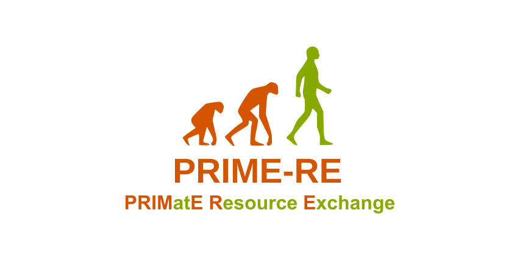

# Welcome to PRIME-RE

Welcome to PRIME-RE, the primary exchange platform for resources related to non-human primate neuroimaging data.

<!---->

The preprocessing and analysis of nonhuman primate (NHP) magnetic resonance imaging (MRI) data presents some unique challenges. Over the years, many laboratories and researchers have created their own custom solutions to many of these problems. PRIME-RE aims to provide an overview of the main difficulties and curate a collection of solutions that currently exist within the broader NHP-MRI community for specific processing steps that are commonly performed on NHP MRI data. Since this is a community effort, we strongly encourage you to contribute your workflows and pipelines. 

PRIME-RE is maintained by members of the [PRIME-DE consortium](http://fcon_1000.projects.nitrc.org/indi/indiPRIME.html), and you can join our discussions around the [data exchange](https://mattermost.brainhack.org/brainhack/channels/prime-de) and the [resource exchange](https://mattermost.brainhack.org/brainhack/channels/compmri_resourcehub) any time.

### Open science

Our goal is to accelerate reproducible discovery, minimise redundant efforts and maximise efficiency by allowing the community to curate relevant resources, disseminate and encourage open science, and strengthen communication and interactions in the research community. We aim at making NHP resources open and [FAIR](https://doi.org/10.1038/sdata.2016.18), as this is essential to enhance reproducibility. Our [template](https://github.com/PRIME-RE/prime-re.github.io/issues/new?assignees=&labels=new-resource&template=new-resource.md&title=%3CResource+Name%3E) for tool submission requires a minimum set of metadata to ensure a consistent and comprehensive index. The data provided by the [PRIME-DE initiative](http://fcon_1000.projects.nitrc.org/indi/indiPRIME.html) complies with the [Brain Imaging Data Structure](https://doi.org/10.1038/sdata.2016.44). PRIME-RE supports the use of BIDS and the adoption of [code development best practices](https://doi.org/10.1038/nn.4550), such as version control, testing, coding style, and continuous integration.

### How to contribute
Send new content by using [this issue template](https://github.com/PRIME-RE/prime-re.github.io/issues/new?assignees=&labels=new-resource&template=new-resource.md&title=%3CResource+Name%3E). You can also join our communication channel on the Brainhack Community via [PRIME-RE Mattermost-channel](https://mattermost.brainhack.org/brainhack/channels/compmri_resourcehub). If you want to discuss the Primate Data Exchange in general, join on [PRIME-DE Mattermost-channel](https://mattermost.brainhack.org/brainhack/channels/prime-de).

### Wiki
A [wiki](https://github.com/PRIME-RE/prime-re.github.io/wiki) has been set up to share knowledge about NHP MRI acquisition and image processing. Anyone can share knowledge and experience (problems with solutions, fixes, tricks...).
