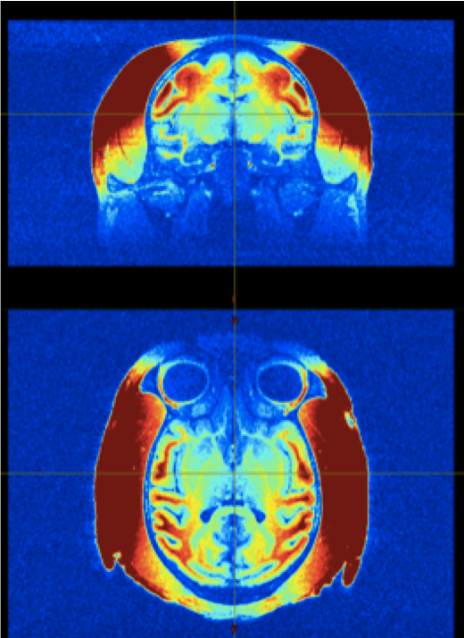

# 1. Structural preprocessing

## Description
Several steps to obtain a segmented brain with possibility to create surfaces

 
## Issues linked to NHP imaging
- non-standard orientation: sphinx position, oblique orientation

- strong intensity bias due to a huge variety of coils used

-  

 
## Steps
 
### Preparation of data (Cropping, deoblique…)

- **What is is about?**

- **Solutions**
  
### Registration to template
 
### Brain extraction / skull stripping
 
### Segmentation (GM, WM, CSF? Subcortical?bone, non brain soft tissue? air?)
 
### Surface generation
 
### Morphometry measures (thickness, curvature etc)

 
## Links to pipelines

 
## Communication
Link to the communication channel for your project. You can, for example, create a [slack channel](https://brainhack-slack-invite.herokuapp.com/) for your project inside the Brainhack slack community, and include a slack badge  to invite people to Brainhack slack, where they can then find and join your channel.  
Or create a community on [gitter](https://gitter.im/) and link to the chat by including a Gitter badge linking to your community 

